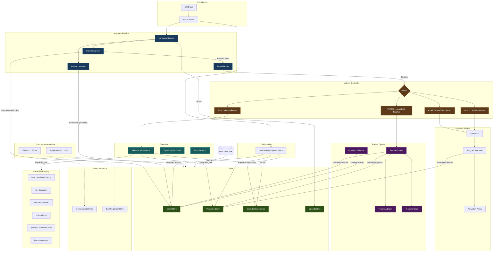

# Executable Knowledge Graph Intelligence (EKG-AI)

EKG-AI is an experiment in **lifelong executable intelligence**: a system whose concepts, language, procedures, capabilities, corrections, tests, and lived episodes accumulate in an inspectable knowledge graph and executable program library.

> **This project is not an LLM.** It is not expected to know the world with zero training. Learning may be bootstrapped; knowledge and understanding are taught and accumulated. The graph and executable library are part of the intelligence itself.

## North star

- **Education, not zero-shot miracles.** EKG is allowed to start ignorant and get taught.
- **Ever-learning.** Useful knowledge is not frozen permanently into model weights.
- **Executable knowledge.** Concepts can ground into typed programs and host capabilities.
- **Makes tools from tools.** Reusable learned compositions become capabilities of the growing system rather than temporary agent-tool calls.
- **Host-adaptive.** Files, paths, process/shell, environment, clocks, and other affordances are explicit host boundaries; EKG should adapt to what a host provides.
- **Semantic portability, not lowest-common-denominator APIs.** A concept may enter the portable core when roughly 80-90% of representative runtimes support the same semantics and outliers have practical adapters (for example Bash + `jq` for recursive JSON/object data). Hosts adapt to EKG's semantic types; one runtime does not define the limits of EKG's ontology.
- **Lived context.** Past lessons, corrections, episodes, programs, semantic relations, and evidence are durable context retrieved from experience rather than repeatedly stuffed into a prompt.
- **Teacher as educator.** Frontier LLM assistance is scaffolding/Teacher supervision whose successful corrections become graph knowledge and future training data.

Read [`docs/PROJECT_GOSPEL.md`](docs/PROJECT_GOSPEL.md) before making architectural tradeoffs.

## Current capabilities

- Language-neutral typed Blueprint IR
- Recursive JSON/object values
- Portable integer, boolean, string, list, and structured-data primitives
- Path/filesystem/environment/time host capabilities
- Bounded process execution and Bash as explicit effectful host capabilities
- Reference execution plus TypeScript/Rust backend support where applicable
- Graph-native concepts, capabilities, teaching traces, and evidence
- Typed synthesis (Search v2) and learned-program reuse
- Natural-language grounding and correction learning
- **LadybugDB** embedded graph backend with OpenCypher queries (auto-fallback to in-memory JSON)
- **Seed brain** with pre-installed English curriculum for instant language understanding
- **EKGBench** - all 20 bAbI prerequisite families plus personal aspirational milestones

## Development model

Red benchmarks are not bugs - they are the curriculum.

```
red milestone -> teaching/experience -> durable competence -> later composition
```

A Teacher lesson supplies a validated Blueprint composed from existing capabilities. After validation, that procedure is acquired as a durable learned capability. The same locked milestone then passes without adding task-specific host primitives. Unsolved milestones remain red until prerequisite concepts are taught.

The curriculum is chosen for **general reuse**, not benchmark convenience. A red task tells us which prerequisite concept is missing; we teach that concept and let benchmark improvement be a consequence.

## Architecture



### How it fits together

**Language pipeline:** Raw utterance hits the `IntentInterpreter`, which resolves lexemes/senses through the knowledge graph. Resolved intents go to the `IntentPlanner`, which compiles semantic relations into portable Blueprint IR.

**Learner controller:** Blueprints enter the `RUN -> ADAPT -> BUILD -> TEACH` decision loop. Known programs execute immediately (RUN). Similar programs seed synthesis (ADAPT). Fresh synthesis explores type-guided search (BUILD). Unknown language or capabilities escalate to Teacher (TEACH).

**Brain:** Four durable stores behind the `Brain` interface - graph (concepts, language, world facts), program library (learned Blueprints), execution experience (call traces), and episodes (task decisions). Two backends: `LadybugBrain` (embedded Kuzu with OpenCypher) and `FileBrain` (JSON fallback).

**Self-healing:** `SelfHealingProgramLibrary` wraps the program library. Recovery chain: live lookup -> graph snapshot restore -> experience-based reconstruction from historical usages. Teacher escalation is last resort.

**Teacher:** `TeacherSchool` validates and commits structured lessons - lexical curriculum, synonyms, executable programs. Successful lessons become durable graph knowledge and learned capabilities. Teaching traces record the full observation/impasse/hypothesis/experiment chain.

### Context-sensitive language

A lexical form is not its meaning. EKG keeps explicit senses and may learn contextual evidence that selects among them without erasing alternatives. See [`docs/CONTEXTUAL_LANGUAGE.md`](docs/CONTEXTUAL_LANGUAGE.md).

## Getting started

### Prerequisites

- Node.js 18+
- npm

### Install and run

```bash
git clone https://github.com/kealjones/ekg-ai.git
cd ekg-ai
npm install
npm run ekg
```

On first run, EKG loads a **seed brain** with a pre-installed English vocabulary (~248 lexemes, grammar rules, and inference rules), so it understands language immediately - no training step required.

### Talk to it

EKG understands natural language requests involving math, string operations, comparisons, logic, and filesystem tasks. Type a request and it figures out what you mean, builds an executable program, and runs it.

```text
EKG> multiply this number by six
input[0] (int)> 7
42

EKG> deduct six from this number :: [20]
14

EKG> what is the length of this text :: ["hello world"]
11
```

The `:: [values]` syntax lets you supply inputs inline instead of being prompted for them.

### Chain operations with "then"

Use the word `then` to compose multi-step operations. Each step feeds its result into the next.

```text
EKG> multiply this number by three then add five :: [4]
17
```

### Teach it new words

EKG doesn't know every word out of the box, but you can teach it. If it doesn't understand something, teach a synonym to a word it already knows.

```text
EKG> triple this number :: [5]
(escalates to Teacher - doesn't know "triple")

EKG> /teach synonym triple = multiply by three

EKG> triple this number :: [5]
15
```

Once taught, new vocabulary is permanent - it survives restarts and participates in future composition.

### Explore its brain

```text
EKG> /brain                        Show brain stats (entities, programs, backend)
EKG> /capabilities                 List all host capabilities EKG can use
EKG> /capabilities fs              Filter capabilities (e.g. filesystem only)
EKG> /programs                     List all learned procedures
EKG> /experience                   Show recent execution traces
EKG> /run <program-id> :: [args]   Execute a specific learned procedure
EKG> /export-seed                  Export current brain as a shareable seed file
EKG> /save                         Force-save brain to disk
EKG> /exit                         Save and quit
```

### What it understands

EKG ships with grounded vocabulary for:

| Domain | Examples |
|--------|----------|
| **Math** | add, subtract, multiply, divide, modulo, negate, absolute value |
| **Comparison** | equals, less than, greater than, at most, at least |
| **Logic** | and, or, not |
| **Strings** | length, concatenate, contains, starts with, ends with, lowercase, uppercase, trim, split, replace |
| **Filesystem** | list files, read file, write file, file exists, basename, dirname, extension, current directory |
| **Selection** | minimum, maximum, largest, smallest |

This vocabulary grows as you teach it new words and as it learns from successful executions.

### How learning works

When you run a request successfully, EKG persists the synthesized program as a **durable learned capability** in its knowledge graph. Next time you say the same thing, it runs the existing program instantly (zero search, zero synthesis). Related requests can adapt from existing programs rather than building from scratch.

```text
EKG> find the file with the longest filename in this folder :: ["./data"]
report.json                          (first time: synthesizes a program)

EKG> find the file with the longest filename in this folder :: ["./other"]
notes.txt                            (second time: runs learned program directly)
```

### Graph backend options

By default, EKG uses an in-memory graph backed by a JSON file. If you install the optional LadybugDB native module, it auto-upgrades to an embedded graph database with OpenCypher queries.

```bash
npm run ekg -- --backend ladybug    # force LadybugDB (needs @ladybugdb/core)
npm run ekg -- --backend memory     # force JSON file
npm run ekg -- --backend auto       # default: LadybugDB if available, else JSON
```

### Run the benchmarks

```bash
npm run benchmark:ekg             # developmental report card (bAbI + object milestones)
npm run benchmark:search-v2       # synthesis engine speed comparison
```

EKGBench is a developmental curriculum, not a pass/fail exam. Red benchmarks tell you which concepts haven't been taught yet.

## Development

```bash
npm test                          # full suite (190 tests)
npm run benchmark:ekg             # developmental report card
npm run benchmark:search-v2       # synthesis engine benchmark
npm run test:ladybug              # LadybugDB mock tests
npm run test:ladybug:integration  # real native round-trip (needs @ladybugdb/core)
```

## Further reading

- [`docs/PROJECT_GOSPEL.md`](docs/PROJECT_GOSPEL.md) - product/research doctrine
- [`docs/PROGRESS.md`](docs/PROGRESS.md) - detailed research log with evidence
- [`CHANGELOG.md`](CHANGELOG.md) - version history
- [`docs/LADYBUGDB.md`](docs/LADYBUGDB.md) - graph backend details
- [`docs/CONTEXTUAL_LANGUAGE.md`](docs/CONTEXTUAL_LANGUAGE.md) - context-sensitive language design
- [`docs/ADR-001-core-invariants.md`](docs/ADR-001-core-invariants.md) - architectural decisions
- [`docs/PREREGISTRATION_V0.3.md`](docs/PREREGISTRATION_V0.3.md) - v0.3 experiment protocol
